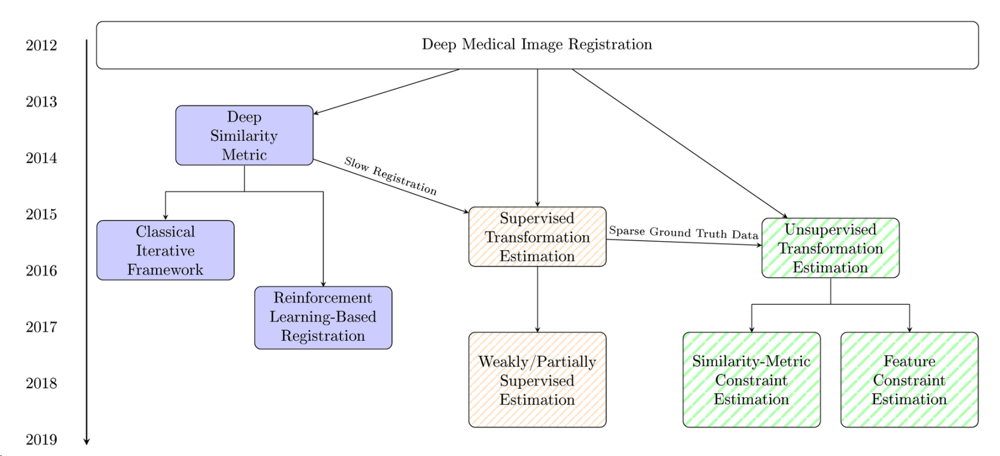
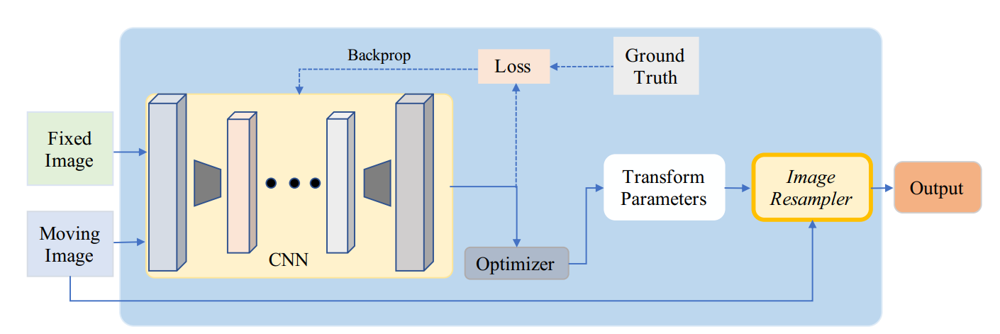
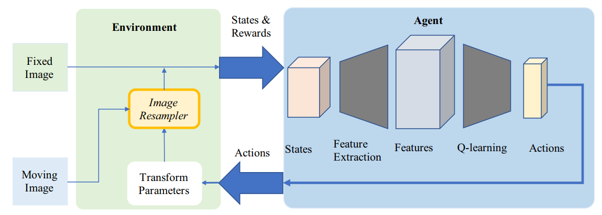

# [Deep medical image registraiton: a survey](https://link.springer.com/content/pdf/10.1007/s00138-020-01060-x.pdf)

!!! attention 3 problem for DL in registration:
    1. **multimodal image:**
       + different fields of view -> hard to extract control point
    2. **deformable registration:**
       + dim of parameters -> high: hard to train/ low: too weak to register S to T
       + constrain of deformation fields -> realistic organ appearence
    3. **grand truth:**
        + real data -> hard to get
        + simulated data -> differet from real

## 1. Deep iterative registration

### 1.1 Deep similarity

Method use CNN to learn a deep similarity metric, than the metric is inserted into classical registration frameworks.

Registration by DL start in this way, which __________

### 1.1.1 unimodal

Deep similarity based methods can't outperform mannually crafted methods. However, it can complement information.

well... it's useless for now.

### 1.1.2 multimodel

| work | Deep similarity |Optimizer| modality | ROI | transform |
|---|---|---|---|---|---|
|[2018 Cheng](https://www.tandfonline.com/doi/full/10.1080/21681163.2015.1135299)|stacked  denoising autoencoder||CT-MR||rigid|
|[2016 Simonvsky](https://link.springer.com/chapter/10.1007%2F978-3-319-46726-9_2)|dissimilarity metric|gradient descent|T1-T2|brain|deformable|
|[2018 Sedghi](https://arxiv.org/pdf/1804.01565.pdf)||powell's method|MR-US||rigid|
|[2018 Haskin](https://europepmc.org/article/MED/30382457)|TRE|evolutionary allgroithm|MR-US||rigid|
|[2018 Wright](https://link.springer.com/chapter/10.1007%2F978-3-030-00807-9_15)|LSTM||MR-US|||

!!! tip ""
    [ - ] Deep similarity isn't competitive in unimodal
    [ - ] The process is slow because of the iterative techniques

### 1.2 reinforcement learning

