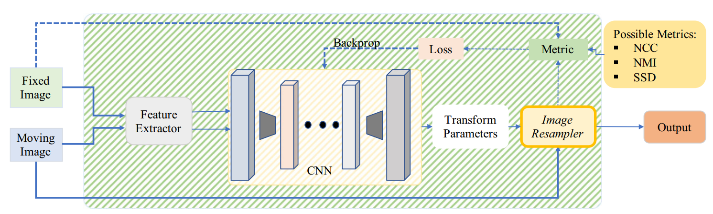

# [Deep medical image registraiton: a survey](https://link.springer.com/content/pdf/10.1007/s00138-020-01060-x.pdf)

!!! attention 3 problems for DL in registration:
    1. **multimodal image:**
       + different fields of view -> hard to extract control point
    2. **deformable registration:**
       + dim of parameters -> high: hard to train/ low: too weak to register S to T
       + constrain of deformation fields -> realistic organ appearence
    3. **grand truth:**
        + real data -> hard to get
        + simulated data -> differet from real

## 1. Deep iterative registration

### 1.1 Deep similarity

Method use CNN to learn a deep similarity metric, than the metric is inserted into classical registration frameworks.

Registration by DL start in this way, which __________

### 1.1.1 unimodal

Deep similarity based methods can't outperform mannually crafted methods. However, it can complement information.

well... it's useless for now.

### 1.1.2 multimodel

| work | method |Optimizer| modality | ROI | transform |
|---|---|---|---|---|---|
|[2018 Cheng](https://www.tandfonline.com/doi/full/10.1080/21681163.2015.1135299)|stacked  denoising autoencoder||CT-MR||rigid|
|[2016 Simonvsky](https://link.springer.com/chapter/10.1007%2F978-3-319-46726-9_2)|dissimilarity metric|gradient descent|T1-T2|brain|deformable|
|[2018 Sedghi](https://arxiv.org/pdf/1804.01565.pdf)||powell's method|MR-US||rigid|
|[2018 Haskin](https://europepmc.org/article/MED/30382457)|TRE|evolutionary allgroithm|MR-US||rigid|
|[2018 Wright](https://link.springer.com/chapter/10.1007%2F978-3-030-00807-9_15)|LSTM||MR-US|||

!!! tip ""
    [ - ] it isn't competitive in unimodal
    [ - ] **SLOW** because of the iterative techniques

### 1.2 reinforcement learning

 Previous optimizaion algorithms are replaced by RL training an agent.

work | method | modality | ROI | transform
---|---|---|---|---
[2017 Liao](https://arxiv.org/pdf/1611.10336.pdf)|greedy, attention-driven hierachial strategy|CT-CBCT|cardiac, abdominal|rigid
[2017 kai](https://link.springer.com/chapter/10.1007/978-3-319-66182-7_28)|Q-learning, leverages contextural information|MR-CT|Chest|rigid
[2017 miao](https://arxiv.org/pdf/1712.01651.pdf)|multi-agent, auto-attention|Xray-CT|spine|rigid
[2017 krebs](https://link.springer.com/chapter/10.1007%2F978-3-319-66182-7_40)|low-resolution, fuzzy-control|2D/3D MR|prostate|deformable

!!! tip ""
    [ + ] **intuitive** for medical image registration
    [ - ] for deformable registration, RL need handle it's high dimensional action space
    [ - ] also **SLOW** because of the iterative techniques

---

## 2.Supervised transformation estimation

Those methods not only measure the similarity, but alse estimate transformation by optimize it. They train an **end-to-end** model. which means, input image pairs, output the transformations in one step. 

### 2.1 Fully suppervised

### 2.1.1 rigid

+ grand truth: synthetic

work | method | modality | ROI 
---|---|---|---
[2016 miao](https://ieeexplore.ieee.org/document/7393571)|hierarchical regression|2D/3D xray|
[2018 chee](https://arxiv.org/pdf/1810.02583.pdf)|AIRNet|MR|brain
[2018 salehi](https://arxiv.org/pdf/1803.05982.pdf)|resNet, bivariant geodesic distance|T1-T2MR|brain
[2018 zhen](https://europepmc.org/article/PMC/PMC5767648)|Paiwide **domain adaptation** module|3Dxray-2Dxray|
[2018 sloan](http://eprints.gla.ac.uk/156798/1/156798.pdf)|different level feature|uni+multi MR|brain

### 2.1.2 deformable

+ grand truth: synthetic + real

work | method | modality | ROI 
---|---|---|---
[2016 yang](https://arxiv.org/pdf/1607.02504.pdf), [2017](https://www.sciencedirect.com/science/article/am/pii/S1053811917305761)|FCN, Diffeomorphisms, momentum|2D/3D MR|brain
[2017 yang](https://cdr.lib.unc.edu/downloads/q811kk416)|low-rank Hessian, Gauss distribution|T1-T2 MR|brain
[2017Rohe](https://rd.springer.com/chapter/10.1007/978-3-319-66182-7_31)|Mesh segmentation|MR|cardiac
[2018 Jun](https://www.ncbi.nlm.nih.gov/pmc/articles/PMC5965487/)|CNN|MR|abdominal
[2017 sokooti](https://elastix.lumc.nl/marius/downloads/2017_c_MICCAIa.pdf)|DVFs(augment dataset), a multi-scaler CNN, late(~~early~~) fusion|CT|chest

more sophisticated graund truth generation

work | method | modality | ROI 
---|---|---|---
[2018 Eppenhof](https://pure.tue.nl/ws/portalfiles/portal/109972398/FINAL_VERSION.pdf)|multiscale random transform|CT|in-exhale lung
[2017 Uzunova](http://www.imiweb.uni-luebeck.de/sites/default/files/paper333_web.pdf)|atatistical appearance models, FlowNet|MR|brain and cardiac
[2018 ito](https://www.researchgate.net/publication/322619625_An_Automated_Method_for_Generating_Training_Sets_for_Deep_Learning_Based_Image_Registration)|CNN learn acceptable deform|MR|brain

!!! tip ""
    [ + ] real-time & robust
    [ - ] depend on graund truth
    [ - ] the differ bettwen synthetic graund truth and clinical data  

### 2.2 Dual/weakly supervised 

+  Dual: grand truth + similarity quantify
+  weak: Using overlap of the ROI(segmentation of corresponding anatomical structure) to design loss

### 2.2.1 Dual:

1. framework of Dual:

2. frmework of Dual using GAN:

work | method | modality | ROI | transform
---|---|---|---|---
[2019 Fan](https://www.ncbi.nlm.nih.gov/pmc/articles/PMC6764428/)|gap-filling, coarse-to-fine guidence|MR|brain|deformable
[2018 yan](https://link.springer.com/chapter/10.1007/978-3-030-00919-9_23)|GAN|MR-US||rigid

!!! tip ""
    [ + ] metric reinforce graund truth
    [ - ] still require graund truth

### 2.2.2 weak:

Tracking **Hu**'s works, about **MR-TRUS deformable** registration. The transformation field consists of affine transformation with 12 degrees and a dense deformable field.

!!! tip ""
    [ + ] avoid graund truth
    [ - ] require manually annotated data(e.g. sementations) 

time | method 
---|---
[2018](https://arxiv.org/ftp/arxiv/papers/1711/1711.01666.pdf)| localNet & globalNet, loaclNet<-(T by gloNet +S)
[2018 later](https://www.researchgate.net/publication/326194769_Weakly-Supervised_Convolutional_Neural_Networks_for_Multimodal_Image_Registration)| local & glo are combined in an end-to-end frame
[2018 another](https://arxiv.org/ftp/arxiv/papers/1805/1805.10665.pdf)| adversarial loss term to force trans to be realistic

## 3 unsupervised

The difficult nature of acquisition of ground truth inspire unsupervised method. Spatial transformer network([STN](https://proceedings.neurips.cc/paper/2015/file/33ceb07bf4eeb3da587e268d663aba1a-Paper.pdf)) is one of the keys.

### 3.1 Similarity metric-based

+ normal

work | method | modality | ROI | transform
---|---|---|---|---
[2017 Neylon](https://jpneylon.github.io/docs/2017-05-05-neural-network-approach-for-fast-automated-quantification-of-dir.pdf)|similarity metric and TRE|CT||
[2018 Dalca](https://arxiv.org/pdf/1805.04605.pdf)|Diffeomorphic integration, velocity field|||deformable
[2019 Kuang](https://arxiv.org/pdf/1811.09243.pdf)|CNN+STN|T1MR|brain|deformable
[2018 Ferrante](http://sinc.unl.edu.ar/sinc-publications/2018/FOGM18/sinc_FOGM18.pdf)|transfer learning-based approach|xray,cardiac cine||
[101 Sun](https://link.springer.com/chapter/10.1007%2F978-3-030-01045-4_18)|intensity and gradient Smetric|MR/US||

+ Extensions

remark | work | method | modality | ROI | transform
---|---|---|---|---|---
Multimodle|[2018 Cao](https://arxiv.org/ftp/arxiv/papers/1804/1804.10735.pdf)|intra modality similarity, "dual" supervised|CT-MR|pelvic|deformable
inverse-consistent|[2018 zhang](https://arxiv.org/pdf/1809.03443.pdf)|ICNet,diffeo-, IC regularization|MR|brain|
GAN|[2019 Mahapatra](https://arxiv.org/pdf/1805.02369.pdf)|density function, ||cardiac cine, retinal|deformable
GAN|[2019 Fan](https://www.ncbi.nlm.nih.gov/pmc/articles/PMC6322551/)|assess quality of the alignment|MR|brain|deformable
GAN, seg & regist|[2018 Mahapatra](https://www.researchgate.net/publication/334129714_Adversarial_optimization_for_joint_registration_and_segmentation_in_prostate_CT_radiotherapy)|(S, T, mask)-GAN->(deform field, W(T),segmentation)|X-ray|chest|defomable
optimal parameterization|[2018CVPR Jiang](https://openaccess.thecvf.com/content_cvpr_2018/papers/Jiang_CNN_Driven_Sparse_CVPR_2018_paper.pdf)|CNN,multi-grid B-spline, L1-norm|CT|thoracic|deformable

### 3.2 feature-based

 work | method | modality | ROI 
---|---|---|---
[2017 Liu](https://www.labxing.com/files/lab_publications/7980-1600854021-eca997Ep.pdf)|PCANet, tensor-based MIND|CT,multi-MR|thoracic,brain
[2018 krebs](https://arxiv.org/pdf/1804.07172.pdf)|stochastic latent space, conditional variational autoencoder|MR|brain,cardiac
[2019 Kori](https://arxiv.org/pdf/1908.06213.pdf)|Dice score|2D T1-T2 MRs|brain

!!! tip ""
    [ - ] the absence of **multimodal case** is because similarity metric between differnt modalitis is hard to quantify.

## 4 conclusion
!!! attention common difficulties:
    + robust similarity matric for multimodal
    + the availability of large data set
   
    !!! info common resolution:
        + application-specific similarity metrics
        + Patchwise framework
        + unsupervised approaches
        + variational autoencoder

---

**_Supplement:_**

+ [domin-transform manifold learning(2017 Nature)](https://www.nmr.mgh.harvard.edu/lfi/pdf/AUTOMAP_Nature_2018.pdf)
+ [learn resampling and interpolation strategy(2019 ALi) ](https://arxiv.org/pdf/1908.06194.pdf)
