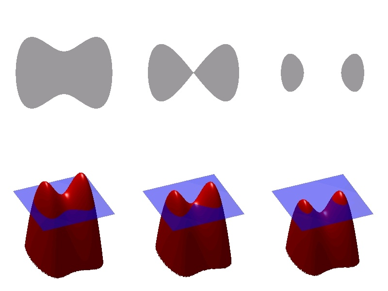
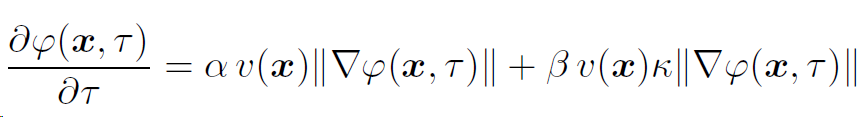

# Dr. Jef Vandemeulebroucke's
 doctoral thesis (2010)
---
 

!!! summary Lung Motion Modelling and Estimation for Image Guided Radiation Therapy
    1. Fast B-spline Interpolation
    2. A Motion Mask for Deforable Registraiton
    3. Spatio-Temporal Motion Estimation
    4. Motion Estimation from Cone-Beam Projrction
    5. 2D-3D Deformable Registration

---

## 1 Fast B-spline Interpolation

+ classical B-spline
step1. Calculate the weights.
step2. calculate interpolated value

`r: free degree` `d: dimension` `i: index at dim j` `p:control ponit`

`c: corresponding coefficients`

1. complexity of step1 : O(r x d x (r+1)^d^)
2. complexity of step2 : O((r+1)^d^)

the complexity of step1 can be reduced cause the symmetry of the image. The **B look-up table(B-LUT)** sample the image to precalculate weights with a sample wight lamda~j~ at dim j. so, the complexity of step1 reduce to **O(dot(lamda) x (r+1)^d^)**

---

## 2. A Motion Mask for breathing

Automatically extract a motion musk from **4D-CT** to separate moving (lungs, mediastinum and abdomen) and less-moving (the remainder) subregions. 

The acquisition of motion musk use level set, a curve fitting method.

the evolution of thelevel set is governed by the following expression:

`k: curvature`

### framework:

1. extract velocity map.(the patient body, the bony anatomy, the lung)
   + by morphology
2. Level-set propogation
   1. initialize a small ellipsoid at the bottem of abdomen
   2. fill the abdomen (v(x) = 1, except at the bony anatomy where v(x) = 0)
   3. fill the entire thoracic cavity (everything outside the patient body yields v(x) = 0)
   4. contract to the lungs. Smooth the musk by punishing the large curvature.

---

## 3. Spatio-Temporal Motion Estimation for 4D-CT
 
 Estimate T~st~(x, t) from 4D-CT.

### 3.1 Spatial Registration 
+ by B-Spline

Learning the B-spline cooefficients a = {a~j~} by optimising.

### 3.2 Trajectory Modelling
Tracking the trajectory of ***x*** at time ***t*** by B-spline with _**s**_ temporal control points. 

the **trajectory(red line)** of tr along the interval [0,t~e~), with 5 control points inside and 3 control points outside the interval.

### 3.2.1 Smooth Trajectory Model

### 3.3 Spatio-Temporal Registration

### 3.4 result

---

## 4. Motion Estimation from Cone-Beam Projrction

Method is for estimating **3D+T** respiratory motion from the **2D+T** cone-beam projection sequence by including prior knowledge(from 4D-CT) about the patient's breathing motion.

We already have past S-T motion, this method handle that how to update it using cone-beam projection.

---

## 5. 2D-3D Deformable Registration

This work estimate the 3-D deformation to align reference image (CT) to the in-room projection sequence(CBCT).

Motion estimation without prior model.