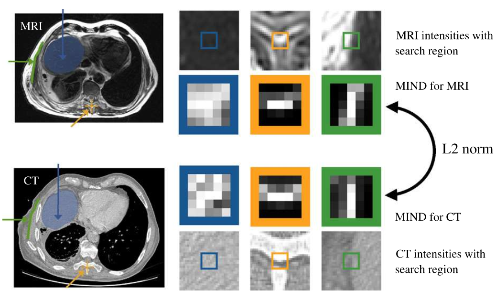

# **`Conventional Similarity`**

+ sum-of-square distance (SSD)
+ mean square distance (MSD)
+ (normalized) cross correlation (CC)
+ (normalized) mutual information (MI)

some `conventional` method:

## [modality independent neighborhood descriptor (MIND)](https://www.sciencedirect.com/science/article/pii/S1361841512000643?via%3Dihub)

+ for multi-modle/ small image patches/ dense manner/ optimised using SSD/ local self-similarity
  
    
*`blue`*: homogenous intensities (liver)
*`yellow`*: corner points at one vertebra
*`green`*: image gradients at the boundary between fat and non-fat tissue

+ self-simiarity as image discriptor

1. [corrilation ratio based MI](https://www.ncbi.nlm.nih.gov/pmc/articles/PMC5234261/)
2. [contextual conditioned MI](../contextual_conditioned_MI.pdf)
